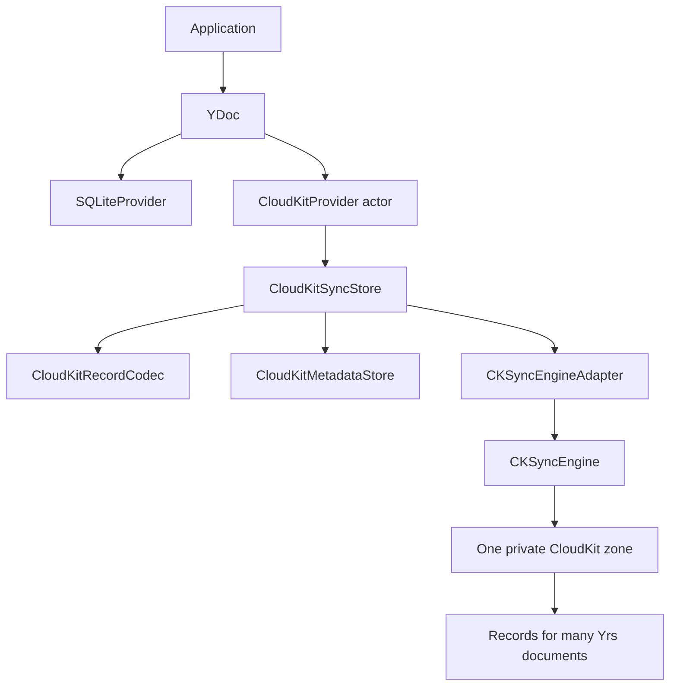
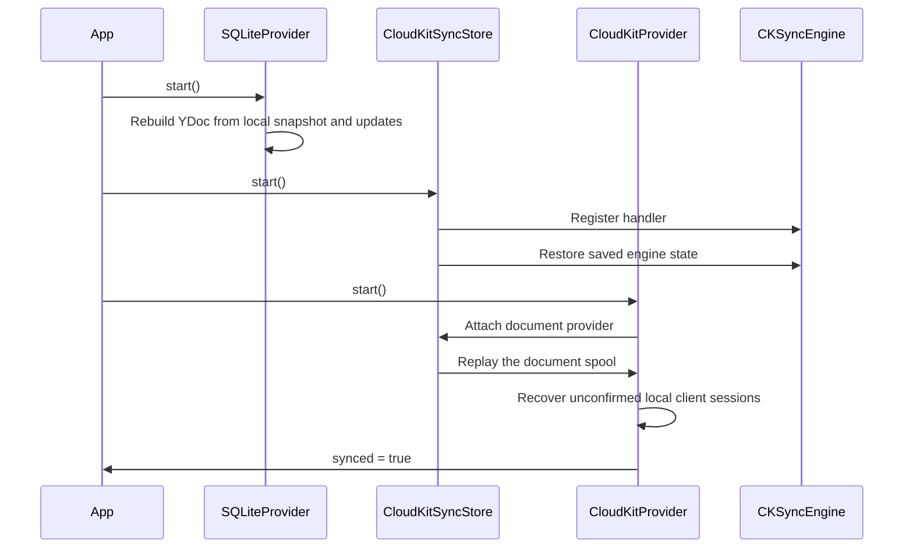
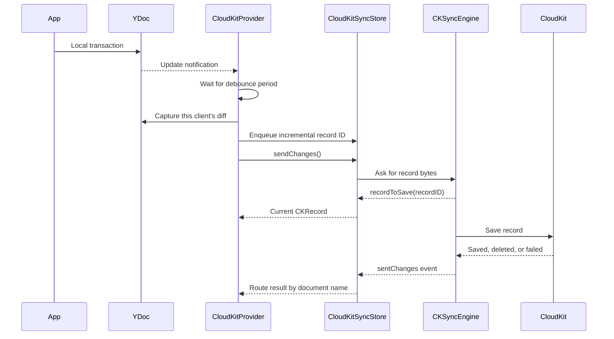
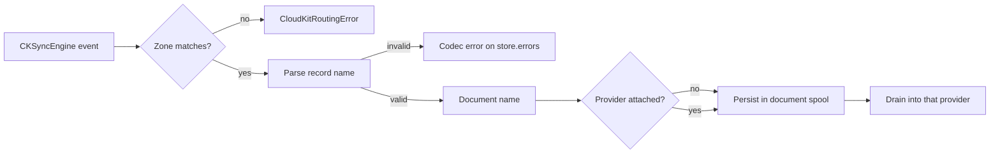
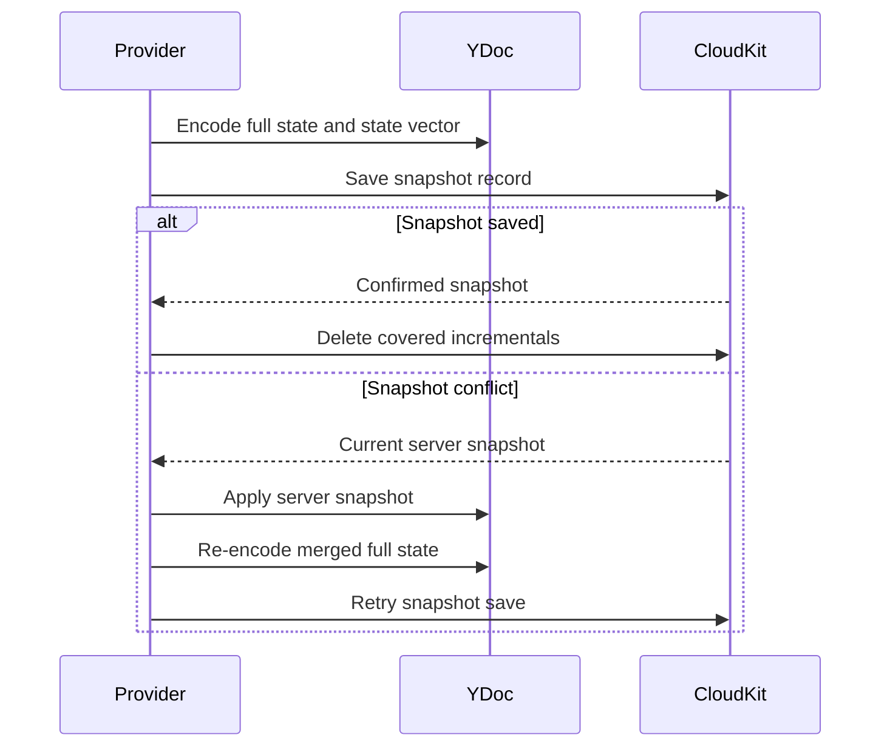

# CloudKit provider

`SwiftYrsCloudKit` synchronizes Yrs documents through CloudKit. It uses one
`CKSyncEngine` and one private database zone for each `CloudKitSyncStore`. The
zone can contain many Yrs documents. A `CloudKitProvider` owns one of those
documents.

This document describes the implementation in:

- [`CloudKitProvider.swift`](../Sources/SwiftYrsCloudKit/CloudKitProvider.swift)
- [`CloudKitSyncStore.swift`](../Sources/SwiftYrsCloudKit/CloudKitSyncStore.swift)
- [`CloudKitRecordCodec.swift`](../Sources/SwiftYrsCloudKit/CloudKitRecordCodec.swift)
- [`CKSyncEngineAdapter.swift`](../Sources/SwiftYrsCloudKit/CKSyncEngineAdapter.swift)

The design is recorded in
[ADR-0022](adr/0022-sqlite-database-provider-uses-store-backed-append-log.md),
[ADR-0024](adr/0024-subdocument-handles-are-boxed-doc-clones.md), and
[ADR-0025](adr/0025-one-cloudkit-zone-per-store-holds-many-documents.md).

## Design at a glance

The app owns the Yrs document. The local SQLite provider and the CloudKit
provider observe the same document. CloudKit does not become the local source of
truth.



The main ownership rules are:

| Component               | Owns                                                          | Does not own                 |
| ----------------------- | ------------------------------------------------------------- | ---------------------------- |
| `YDoc`                  | CRDT state and local transactions                             | CloudKit requests            |
| `SQLiteProvider`        | Local Yrs update persistence                                  | CloudKit metadata            |
| `CloudKitProvider`      | One document's upload, download, recovery, and compaction     | Other documents in the store |
| `CloudKitSyncStore`     | One engine, one zone, provider routing, spooling, and removal | Yrs document content         |
| `CloudKitRecordCodec`   | Zone IDs, record IDs, encoding, decoding, and validation      | Sync scheduling              |
| `CloudKitMetadataStore` | Durable engine and provider bookkeeping                       | Yrs updates                  |
| `CKSyncEngineAdapter`   | The CloudKit engine bridge                                    | Yrs-specific merge logic     |

## One store, one zone, many documents

Create one store for one logical dataset. For a wiki application, the dataset is
normally one vault. Pass the vault ID as `zoneName`.

```swift
let codec = try CloudKitRecordCodec(
    zoneName: vaultID.uuidString,
    assetDirectory: supportDirectory.appendingPathComponent("cloudkit-assets")
)

let store = CloudKitSyncStore(
    adapter: CKSyncEngineAdapter(containerIdentifier: containerIdentifier),
    codec: codec,
    metadataStore: FileCloudKitMetadataStore(
        directory: supportDirectory.appendingPathComponent("cloudkit-metadata")
    )
)

await store.start()

let rootProvider = try CloudKitProvider(
    documentName: "root",
    doc: rootDocument,
    store: store
)
try await rootProvider.start()

let pageProvider = try CloudKitProvider(
    documentName: pageID.uuidString,
    doc: pageDocument,
    store: store
)
try await pageProvider.start()
```

The codec creates a zone ID with this form:

```text
swiftyrs.<url-safe-base64(zoneName)>
```

The store never creates a zone from a document name. Each provider uses the same
store zone, and record names identify the document inside that zone.

This is a breaking change from the old zone-per-document mapping. Records
written by that mapping are not readable by the current codec. The library is
pre-1.0 and has no known production data using the old mapping. Local SQLite
data is not changed by this CloudKit migration.

## Startup order

Start local persistence before CloudKit.



`CloudKitProvider.start()` must see the reconstructed document before it
performs recovery. If the app starts CloudKit first, recovery can use an empty
or incomplete document and fail to resend local edits from an earlier launch.

Call `store.start()` once. Start each document provider after the store starts.
Starting a provider twice has no effect after the first successful start.

## Provider lifecycle

`CloudKitProvider` is an actor because the Yrs document can be used by the app
and by more than one provider. Yrs rejects conflicting transactions. The
provider performs short document operations and retries a transaction conflict
up to `maxTransactionRetries`.

The normal lifecycle is:

1. Construct a `CloudKitProvider` with a document name, a `YDoc`, and a store.
2. Call `start()`.
3. Make local edits through the `YDoc`.
4. Call `flush()` when the app needs an immediate upload, or let the debounce
   task upload the edit.
5. Call `fetch()` when the app wants to pull changes immediately.
6. Call `flushForBackground()` before the app enters the background.
7. Call `destroy()` when the document provider is no longer needed.

The public operations are:

| Operation              | Behavior                                                                                                   |
| ---------------------- | ---------------------------------------------------------------------------------------------------------- |
| `start()`              | Attaches the provider, drains inbound changes, restores recovery state, and begins observing the document. |
| `flush()`              | Cancels the pending debounce, captures this session's diff, sends it, and checks compaction.               |
| `flushForBackground()` | Runs the same work as `flush()`.                                                                           |
| `fetch()`              | Asks the store's engine to fetch remote changes.                                                           |
| `compact()`            | Writes a full snapshot now. It bypasses threshold and jitter checks.                                       |
| `destroy()`            | Stops ingress, detaches the provider, cancels observation, and finishes its streams.                       |

The provider exposes three `AsyncStream` values:

- `synced` emits `true` after startup, after a successful send, and after a
  successful remote apply.
- `errors` receives codec, CloudKit, transaction, metadata, and apply errors
  that the provider cannot return from an asynchronous callback.
- `accountChanges` emits `signIn`, `signOut`, and `switchAccounts`.

## Upload flow

The provider observes Yrs updates. The observer only schedules work. It does not
read the document because the Yrs commit callback can run on the committing
thread.



The provider captures only the changes authored by its current `clientID`. The
marker advances only after CloudKit confirms the incremental record. This
prevents a failed send from losing local work.

The record bytes are resolved at send time. If a record became obsolete, the
provider returns `nil` and the engine skips that record.

The default quiet period is 30 seconds. Apps can set a different value with
`CloudKitProviderOptions(debounce:)`.

## CloudKit record format

The codec uses two record types.

| Record type                 | Record name                                                  | Main fields                                                        |
| --------------------------- | ------------------------------------------------------------ | ------------------------------------------------------------------ |
| `SwiftYrsIncrementalUpdate` | `doc.<enc(documentName)>.incremental.<clientID>.<from>.<to>` | `documentName`, clocks, encoding, and inline or asset update bytes |
| `SwiftYrsSnapshot`          | `doc.<document>.snapshot`                                    | `documentName`, encoding, full update asset, and state vector      |

The actual incremental name is:

```text
doc.<url-safe-base64(documentName)>.incremental.<clientID>.<fromClock>.<toClock>
```

The actual snapshot name is:

```text
doc.<url-safe-base64(documentName)>.snapshot
```

The URL-safe Base64 component does not contain `.`, so the codec can parse the
name with a dot-separated format. The store uses this name for routing. It
cannot depend on record fields because a deleted-record callback contains only
the `CKRecord.ID`.

The codec still stores `documentName` in each record. Decode checks all of the
following:

1. The record name has a valid shape.
2. The record name's kind matches the CloudKit record type.
3. The document in the record name matches the `documentName` field.
4. The fields have the expected type and update encoding.

Malformed records produce a typed error. The store reports the error and does
not route the record to another provider.

### Payload size

Incremental updates at or below `inlineBytesLimit` use the `inlineUpdate` field.
The default limit is 900,000 bytes. Larger incrementals use a `CKAsset` in the
`assetUpdate` field. Snapshots always use a `CKAsset` in the `snapshotUpdate`
field.

The asset directory is a local staging directory for CloudKit record assets.
These assets are Yrs update payloads. They are not application attachments such
as images or PDFs.

### Name length checks

CloudKit limits record and zone names to 255 characters. The URL-safe Base64
encoding can make a caller name longer. An over-long name can cause an
Objective-C exception, so the codec checks the length before it creates a
CloudKit ID.

- `CloudKitRecordCodec` throws `zoneNameTooLong` during initialization.
- `codec.documentKey(_:)` throws `documentNameTooLong`.
- `CloudKitProvider` validates its document name during initialization.

`CloudKitDocumentKey` stores the checked encoded document name. Record ID
builders use this key and do not repeat a throwing length check.

## Routing inside a shared zone

The store keeps a weak provider registry keyed by `documentName`.



The store routes these callbacks by document:

- `recordToSave`
- fetched modifications
- fetched deletions
- saved records
- deleted records
- failed saves

A provider receives only records for its document. A second provider with the
same document name is rejected with `duplicateProvider`.

## Inbound changes and the durable spool

CloudKit can fetch a zone when a document provider is not attached. This is
normal when the app loads page subdocuments lazily. The engine can also advance
its change token after that fetch. Dropping the record at that point would lose
the remote change.

The store therefore uses one path for every fetched change:

1. Check that the record belongs to this store's zone.
2. Parse and decode the record while any `CKAsset` file is available.
3. Append the decoded `InboundChange` to the document's persisted spool.
4. If the provider is attached, drain the spool into it.
5. Remove entries only after the provider applies them.

The store spools decoded payloads, not `CKRecord` values. This reads each asset
file once. Re-encoding a record for later replay would create another local
asset file and would add no value.

The spool stores these entries:

| Entry       | Use                                                                               |
| ----------- | --------------------------------------------------------------------------------- |
| Incremental | Apply a client-scoped Yrs update.                                                 |
| Snapshot    | Apply a full Yrs update and record its state vector.                              |
| Deletion    | Forget a CloudKit record that the server deleted. It does not remove Yrs content. |

Entries have increasing sequence numbers. The provider applies entries in
arrival order. The store removes a batch by its last sequence number, not by
array position. This matters when a new snapshot coalesces entries while a
provider is applying an older batch.

If the process stops after apply and before removal, the update is replayed. Yrs
updates are idempotent and commutative, so replay is safe.

### Spool coalescing

The spool does not drop the oldest update to enforce a size limit. That would be
unsafe for a CRDT update stream. When a snapshot arrives, the store keeps the
newest snapshot and drops earlier snapshots and incrementals covered by its
state vector. Incrementals not covered by that state vector stay in the queue.

This normally keeps an unopened document near one snapshot plus newer changes.
There is no hard spool size cap in the current implementation.

## Remote apply

`CloudKitProvider.handleFetched` applies incremental and snapshot updates with
transaction-conflict retries. A deletion is only CloudKit record garbage
collection. Its Yrs content is already represented by the document or a
snapshot, so the provider does not apply a deletion to the YDoc.

Remote updates do not cause an upload echo. Local capture is scoped to the
provider's own `clientID`. Applying another client's update does not advance
that client clock, so the next local flush has no duplicate diff.

## Snapshots, compaction, and garbage collection

The provider tracks incremental records for its document. By default, it
attempts compaction when either condition is true:

- 64 incremental records exist, or
- the incremental payloads total 512 KiB.

The policy adds up to 25 percent random threshold jitter. This reduces the
chance that all devices compact the same document at the same time.

Before compaction, the provider fetches CloudKit again. If another device has
already saved a snapshot that covers the backlog, the provider skips its own
snapshot.

The snapshot flow is:



The provider deletes an incremental only after CloudKit confirms the snapshot
that covers it. A failed snapshot does not delete its incrementals.

Snapshot conflicts use a lossless merge. The provider applies the server
snapshot to the local YDoc, captures the merged state, and retries the same
snapshot record. Yrs state only grows during this merge.

## Recovery after a crash

The provider persists a drain set per document. Each entry records a client ID
and the clock marker from which the provider must resend.

At startup, the provider:

1. Loads the previous drain set.
2. Adds the current client ID with its initial marker.
3. Re-derives each older client's outstanding diff from the reconstructed YDoc.
4. Re-enqueues non-empty diffs.
5. Retires entries that have no outstanding diff.

This avoids a durable outbox of duplicate Yrs data. The local YDoc and the small
drain set are enough to rebuild the pending upload after a crash.

## Durable metadata

`CloudKitMetadataStore` is an injected key/value store. The package provides:

- `FileCloudKitMetadataStore` for a directory of atomically-written files.
- `SQLiteCloudKitMetadataStore` for the `SwiftYrsSQLite` store.

The provider uses these keys:

| Key                       | Scope    | Contents                                      |
| ------------------------- | -------- | --------------------------------------------- |
| `cloudkit.engineState`    | Store    | `CKSyncEngine.State.Serialization`.           |
| `cloudkit.knownDocuments` | Store    | Documents with CloudKit-local state.          |
| `cloudkit.drainSet`       | Document | Open client IDs and clock markers.            |
| `cloudkit.inboundSpool`   | Document | Fetched changes waiting for apply.            |
| `cloudkit.knownRecords`   | Document | Record names known to belong to the document. |

The store namespace for store-level values is `__swiftyrs_cloudkit_store__`.

Persist the engine state. If it is missing or cannot be restored, CloudKit must
fetch from an earlier point. The implementation reports metadata errors through
`CloudKitSyncStore.errors` and treats corrupt bookkeeping as empty state so the
app can rebuild it.

## Removal

The store supports two removal levels.

### Remove one document

```swift
try await store.removeDocument(named: pageID.uuidString)
```

This operation:

1. Rejects the request if that document has an attached provider.
2. Reads the document's known record IDs.
3. Enqueues CloudKit deletes for those records.
4. Clears the document's drain set, inbound spool, known-record registry, and
   document index entry.

`removeDocument` is best effort. `CKSyncEngine` has no query API for all records
in a document. A crash between a server save and the registry write can leave a
record that the registry does not know about. The next confirmed snapshot can
collect an obsolete incremental.

### Remove the whole zone

```swift
try await store.removeZone()
```

`removeZone()` deletes the CloudKit zone and all documents in it. It is the
exact operation for deleting a vault or another whole dataset. It rejects the
request while any provider is attached.

The store keeps the store-level engine state after this operation. The state
belongs to the engine, not to one document. A caller that creates a new dataset
with the same zone name must decide whether to clear or replace that state.

Removal and attachment cannot run at the same time. A provider that tries to
attach during removal receives `removalInProgress`. This prevents a new
provider's bookkeeping from being deleted by an operation that started first.

## Account changes

The adapter maps CloudKit account events to:

```swift
enum CloudKitAccountChange {
    case signIn
    case signOut
    case switchAccounts
}
```

On sign-out or account switch:

- the store clears its persisted engine state;
- each provider stops accepting new uploads;
- pending debounce work is cancelled;
- queued records are removed;
- known incremental tracking is cleared;
- the document's drain set is cleared;
- the provider emits the account event.

The provider does not upload the existing document automatically to a new iCloud
account. The app must decide whether to discard, keep, export, or attach the
local document to the new account. The current provider remains suspended;
recreate it when the app has made that decision.

## Error handling

Use the throwing methods for errors at the call site. Observe `errors` for
errors from engine callbacks and background debounce work.

Important errors include:

| Error                                           | Meaning                                                         |
| ----------------------------------------------- | --------------------------------------------------------------- |
| `CloudKitProviderError.duplicateProvider`       | Another provider owns the document name.                        |
| `CloudKitProviderError.activeProvider`          | Removal was requested while a provider is attached.             |
| `CloudKitProviderError.removalInProgress`       | Attachment or removal overlaps another removal.                 |
| `CloudKitProviderError.transactionConflict`     | Retry limits were reached while reading or writing Yrs state.   |
| `CloudKitProviderError.destroyed`               | A destroyed provider was started again.                         |
| `CloudKitRoutingError.foreignZone`              | A callback contains a record from another zone.                 |
| `CloudKitRecordCodecError.malformedRecordName`  | A record ID cannot identify a valid document and record kind.   |
| `CloudKitRecordCodecError.documentNameMismatch` | The record name and field identify different documents.         |
| `CloudKitSendError.serverRecordChanged`         | A snapshot save conflicted. The provider merges and retries it. |
| `CloudKitSendError.zoneNotFound`                | CloudKit no longer has the zone.                                |
| `CloudKitSendError.unknownItem`                 | CloudKit cannot find the record being changed.                  |
| `CloudKitSendError.other`                       | Another CloudKit save error occurred.                           |

Malformed or foreign records are dropped after the store reports the error. They
never fall back to another provider.

## Testing

The CloudKit tests use `MockCloudKitSyncEngine`, which implements the same
`CloudKitSyncEngineAdapter` protocol as `CKSyncEngineAdapter`. This keeps the
provider tests deterministic and avoids a live iCloud account.

The test suite covers:

- record encoding and decoding;
- document routing in one shared zone;
- malformed and forged record names;
- interleaved changes for multiple documents;
- spooling while a provider is closed;
- spool replay after a relaunch;
- snapshot coalescing;
- apply-then-remove crash safety;
- incremental and snapshot compaction;
- merge-on-conflict behavior;
- recovery of unconfirmed client sessions;
- per-document removal and whole-zone removal;
- account sign-out and account switching;
- provider destruction;
- the real adapter's `CKSyncEngine` event mapping.

Run the package tests with:

```sh
swift test
```

The `CKSyncEngineAdapter` and `CloudKitProvider` compile only when the target
platform provides CloudKit. The package supports iOS 17 and macOS 14 for this
target.

## Integration guidance for a subdocument wiki

Use one `CloudKitSyncStore` for one vault. Give it the vault UUID as its zone
name. Start the root document provider at vault open. Start page providers when
the user opens a page. Remote updates for closed pages remain in the inbound
spool until their providers start.

Keep application attachments outside Yrs documents. The CloudKit asset fields in
this provider carry Yrs update payloads only. Image, PDF, and other vault assets
need an app-owned record and blob design.

The provider is a sync transport. It does not define the wiki model, folder
tree, Markdown format, asset references, or publishing protocol.

## Current limits

- The concrete adapter uses the user's private CloudKit database.
- CloudKit sharing with `CKShare` is not implemented.
- Application attachment synchronization is not implemented.
- The inbound spool has coalescing but no hard size limit.
- Per-document removal is best effort. Whole-zone removal is exact.
- The zone-per-document record layout is not backward compatible with the
  current shared-zone layout.
- The provider suspends after sign-out or account switch. The app must create a
  new provider after it decides how to handle the local document.
